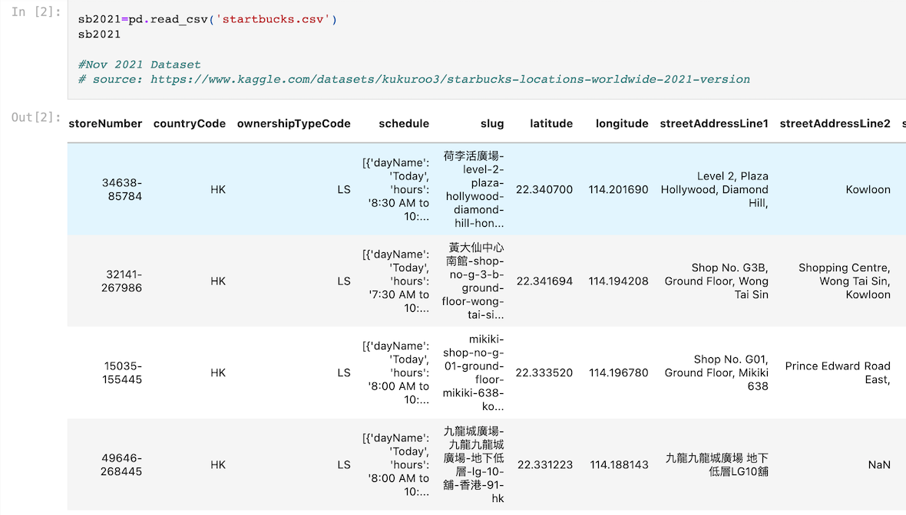

## Mapping Starbucks locations with country population data

[Click for 9-minute recording of final presentation](https://ironhack.zoom.us/rec/play/z_KuzP88l79dzVBAtHaR-vPE4Xi4xUGUU-C3D948G81Z7jHR7GCBa8oip2yDNDrNwbnBrP9AWwVZ6sM9.WElypAcnuo2-6udI?startTime=1660305720000&_x_zm_rtaid=v-1r2qOaSt-VQG_GldUWIA.1660487182977.ee234b4949979eb90f4b2d2092f0085f&_x_zm_rhtaid=21)
[Click for presentation slides](https://slides.com/hollydalton/deck-5b0977/fullscreen)
[Click for Kaggle dataset](https://www.kaggle.com/datasets/kukuroo3/starbucks-locations-worldwide-2021-version)
[Click for World population data](https://worldpopulationreview.com/countries)

---

### Inspiration: Geospatial Analysis is on the rise! 
Geospatial data analysis goes beyond determining not just what happens, but also where and why it happens, at a specific place and/or time. Companies are using geospatial data for site selection of new stores, market analysis, locating real-time hotspots, and even for suppy-chain optimization and fraud detection. Using Starbucks location data, I answer a few strategic business questions with my analysis:

1. How has Starbucks expanded overseas?
      - What are the top 15 countries with the most Starbucks stores?
      - What are the top countries with the most Starbucks stores, per capita?
      - What are the top countries with highest density of Starbucks stores, by area?
2. Where in the world do the earliest Starbucks locations open, and at what time?
3. Where in the world are the two Starbucks locations closest in proximity to one another?

---

### Main Findings
#### 1. What are the top 15 countries with the most Starbucks stores?

#### 2. Where in the world do the earliest Starbucks locations open, and at what time? (Excluding licensed stores, such as those inside hospitals, train stations, airports, etc.)
Answer:  In the U.S. there are 38 company-owned Starbucks coffeehouses that open at 3:30 AM! 
In the map below, green dots represent stores that open at 3:30 AM. 

#### 3. Where in the world are the two Starbucks locations closest in proximity to one another?
Answer: In Jakarta, Indonesia 🇮🇩 there are two stores that are less than 80 meters apart, or less than a 2-minute walk! 

---

### Data: 16 location features of over 28,000 Starbucks Locations
#### Here's a quick look at the raw dataset 

#### I eliminated many of the features and focused my analysis on: 
- Country 
- City
- Ownership type (Company owned, Licensed, Joint Venture or Franchise)
- Hours of operation 
- Latitude and Longitude (Accurate up to 6 decimal points) 

#### I later web scraped and added to the data:
- 2021 Country population
- Country area
- Country population density (km²)

---

### Process
1. Import Starbucks dataset from Kaggle to python and complete exploratory data analysis
2. Data cleaning: 
      - Handle NaNs, duplicates and empty cells, outliers
      - Standardize features names
      - Use regex to reformat opening hours into readable form 
      - Decide columns and rows to drop
3. Web scrape population data from https://worldpopulationreview.com
4. Create new dataset with population and Starbucks data and clean the dataset
5. Build function to compare Latitude and Longitude of every Starbucks to find the two that are closest to each other (this was quite advanced and I had help from instructor, Jan Molendijk) 
6. Fill 18% NaNs in the "Hours of Operation" column: 
    - Use the "Hours of Operation" of the  literal "nearest neighbor" found with the #5 Function
7. Data Visualizations in Tableau
     - Map of Starbucks stores that open the earliest
     - Bar chart of countries with most Starbucks (top 15)
     - Bar chart of Starbucks per capita
     - Map of world showing country with most Starbucks per area (density)
     - Map of world showing country with 2 Starbucks that are closest to each other (using Lat/Long)
8. Prepare presentation on slides.com with results 
9. 9-minute presentation with discussion afterwards with 20+ Ironhack colleagues 
