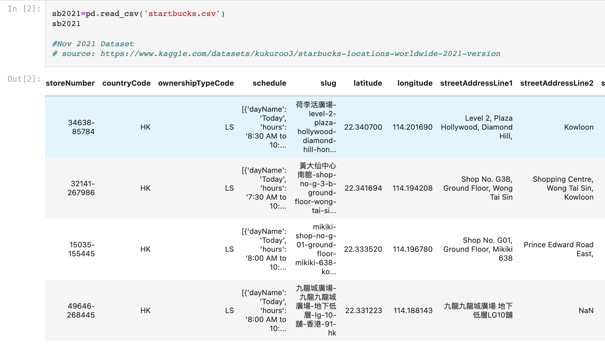

# Analysis of Starbucks Locations 

## Mapping Starbucks locations with latitude/longitude and population data

[Click for 9-minute recording of final presentation](https://ironhack.zoom.us/rec/play/z_KuzP88l79dzVBAtHaR-vPE4Xi4xUGUU-C3D948G81Z7jHR7GCBa8oip2yDNDrNwbnBrP9AWwVZ6sM9.WElypAcnuo2-6udI?startTime=1660305720000&_x_zm_rtaid=v-1r2qOaSt-VQG_GldUWIA.1660487182977.ee234b4949979eb90f4b2d2092f0085f&_x_zm_rhtaid=21)

[Click to view presentation slides](https://slides.com/hollydalton/deck-5b0977/fullscreen)

[Click to view Kaggle dataset](https://www.kaggle.com/datasets/kukuroo3/starbucks-locations-worldwide-2021-version)

[Click for World population data](https://worldpopulationreview.com/countries)

### Objective: Use web scraped Starbucks store location data and population data to answer 3 questions:
1. How has Starbucks expanded overseas?
      - What are the top countries with the highest number of Starbucks stores, per capita?
      - What are the top countries with highest density of Starbucks stores, by area?
      - What are the top 15 countries with the most Starbucks stores?
2. Where in the world do the earliest Starbucks locations open, and at what time?
3. What two Starbucks locations are the closest in proximity to one another?

#### Data: 16 location features of over 28,000 Starbucks Locations:

- **Store Number**: A sequential number assigned to each store.
- **Country Code**: 2-letter code indicating in which country the store is located 
- **Ownership type**: Company owned, Licensed, Joint Venture or Franchise
- **Schedule**: Hours of operation of the store
- **Slug**: A unique identifying part of the store locator web address, from the end of the URL.
- **Latitude**: Exact latitude up to 6 decimal points of the store
- **Longitude**: Exact longitude up to 6 decimal points of the store
- **Street address line 1**: First part of street address
- **Street address line 2**: Second part of street address
- **Street address line 3**: Third part of street address (if any)
- **City**: The city in which the Starbucks store is located
- **Country subdivision code**: 2-digit or 2-letter code to identify subdivision within country
- **Postal Code**: 5-10 digit postal code for location of store
- **Current time offset**: +/- 3-digit number of timezone of store in relation to Greenwich mean time 
- **Windows timezone ID**: Identifies time zone for Windows 
- **Olson timezone ID**: Timezone ID in relation Greenwich Mean Time 

#### I later web scraped and added to the data:
- 2021 Country population
- Country area
- Country population density (km²)
- Count of Starbucks stores by country
- Starbucks store density (km²)
- Starbucks per capita

#### Process
1. Find and import Starbucks dataset from Kaggle to python and complete exploratory data analysis
2. Data cleaning: 
      - Handle NaNs, duplicates and empty cells, outliers
      - Standardize features names
      - Regex to reformat opening hours into readable form 
      - Decide which columns/rows to drop
3. Web scrape population data from https://worldpopulationreview.com
4. Create new dataset with population and Starbucks data and clean the dataset
5. Build function to compare Latitude and Longitude of every Starbucks to find the 2 that are closest to each other
6. Fill 18% NaNs in the "Hours of Operation" column: 
    - Use the "Hours of Operation" of the  literal "nearest neighbor" found with the #5 Function
7. Data Visualizations in Tableau
     - Map of Starbucks stores that open the earliest
     - Bar chart of countries with most Starbucks (top 15)
     - Bar chart of Starbucks per capita
     - Map of world showing country with most Starbucks per area (density)
     - Map of world showing country with 2 Starbucks that are closest to each other (using Lat/Long)
8. Prepare presentation on slides.com with results 
9. 9-minute presentation with discussion afterwards with 20+ Ironhack colleagues 
